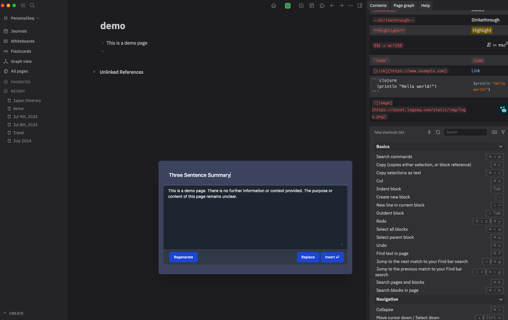

<p align="center">
  <a href="" rel="noopener">
 </a>
 </a>
</p>

<h3 align="center">logseq-plugin-gemini</h3>

<div align="center">

[]()
[](https://github.com/nicklewanowicz/logseq-plugin-gemini.svg)
[](https://github.com/nicklewanowicz/logseq-plugin-gemini.svg)
[](/LICENSE)

</div>

---

<p align="center"> A plugin for Gemini AI assisted note taking in Logseq. Uses Gemini API `gemini-1.5-flash` model by default.
    <br>
</p>

## Demo



 [](https://twitter.com/imnickdev) Follow me on Twitter for updates: [@bsunter](https://twitter.com/imnickdev)

# Usage

##  `commands`

To bring up the gpt popup, use the keyboard shortcut `cmd+g`, or select `gpt` from the block or slash menu.

If you are currently in a block, the plugin will use the text in the block as input to the prompt.

You can click and drag or shift+click to select multiple blocks to use as input to the prompt.

If you are not in a block, the plugin won't add any additional input text to your prompt, and will append the results of the prompt to the bottom of the page.

After selecting the prompt and generating a response, a preview of the response will be shown in the popup. You can click the `Insert` button or press the enter key to insert the response into the page.

You can also click the `Replace` button to replace the selected block with the response.

If you don't like the response, you can click the `Regenerate` button to generate a new response.
### Custom prompts
After you open the popup, you can write any text you want to use as the prompt.

For example you can write `create flashcards based on the following text:` and the plugin will generate flashcards for you to study:

### Built-in prompt templates
There are a number of built in prompt templates that you can use to generate text. These are useful for generating outlines, summaries, and other tasks.


#### Most important ideas


#### Common Objections

#### Ask questions

### User prompt templates
You can also create your own custom prompt templates.
To do this, you create a block with the `prompt-template::` property. The template will be added to the list of templates in the gpt popup.


The `prompt-template::` property is the name of the prompt template.

In a block nested underneath the template block, create a code block in triple backticks with the language set to `prompt`. The text in the code block will be used as the prompt. Make sure the code block is in its own block indented underneath the template block.

For example, you can create a template like this:

<pre>
- # Student Teacher Dialog
  prompt-template:: Student Teacher Dialog
	- ```prompt
	    Rewrite text as a dialog between a teacher and a student:
	  ```
</pre>

#### Student teacher dialog


#### Australian Accent

### Replace
To replace the selected block with the generated text, click the `Replace` button.


### Regenerate

If you don't like the output of the prompt, you can click the `Regenerate` button to generate a new response. Sometimes the first response is not the best, but the second or third response can be better.


## `gpt-block`

Type `/gpt-block` in a block or select `gpt-block` from the block menu.

`gpt-block` will send the block to OpenAI's GPT-3 API and append the response underneath the block.


#### Ask questions


### `gpt-page`

Type `/gpt-page` in a block or select `gpt-page` from the block menu.

`gpt-page` will send the entire page to OpenAI's GPT-3 API and append the response to the bottom of the page.


#### Select Multiple Blocks
You can click and drag or shift+click to select multiple blocks to use as input to the prompt.


### ChatGPT Guidance
You can adjust the `chatPrompt` setting to adjust how ChatGPT should respond to your input. By default, the setting is set to `Do not refer to yourself in your answers. Do not say as an AI language model...` to prevent the model from including unnecessary text in the response.

You can add guidance such as "respond in chinese" or "respond in spanish" to the prompt to get the model to respond in a different language.


## About <a name = "about"></a>

`logseq-plugin-gpt3-openai` allows users to generate human-like text using GPT-3 within the LogSeq editor.

Write a GPT-3 command in a block, then run the open `/gpt` command via the slash or block menu. The plugin will generate a GPT-3 response using the OpenAI API and insert it below. It removes leading and trailing whitespace from the prompt.

## Getting Started <a name = "getting_started"></a>

- You need to [get a gemini API Key here](https://aistudio.google.com/app/) and add the key in the plugin settings.
- The default model is `gemini-1.5-flash` but you can change it to any other one if you prefer. See the [Gemini page](https://ai.google.dev/) for available models.

- Download the plugin in the Logseq marketplace by searching for `gpt` or `gemini`.

## ⚠️ Warning ⚠️

GPT-3 has limitations. It sometimes produces output that is subtly wrong or misleading. Don't rely on its output without verifying it yourself. Use it with caution.

## Example Use Cases <a name = "examples"></a>

## Summarizing or explaining a block of text


## Creating bullet point outlines for a given topic


## Creating study plan for a given topic


## Write a travel itinerary


## Explain how to do something


## Parse tabular data from plain english


### Just for fun


- Generate code to do a given task
- Correct grammar
- Translate into other languages

- Classification and keyword tagging of text
- Generate lists of given topics
  - `List 10 top selling science fiction books`
- Write about a given topic
  - `Write a tagline for an ice cream shop.`
- Answer Questions
  - `Q: How does a telescope work?`

## FAQ <a name = "faq"></a>


### Debugging

]

- Open the developer tools (Menu -> View -> Toggle Developer tools)

- Check the console logs for error messages.


- See if you can figure out the error on your own. Maybe you had a network issue if it says something like "timed out." Sometimes the OpenAI API has issues. You also have a limited number of tokens, so you may run out and need to refill.

- If you can't figure it out based on the error message and it doesn't go away. Make an issue on GitHub.


### Installing

```
pnpm install
```


## Build <a name="usage"></a>

```
pnpm run build
```

## 💻 Local Development

This enables the local dev server with hot reloading, via the logseq vite plugin.

```
pnpm install
pnpm run dev
```

### Prod build

First run `pnpm i` and `pnpm run build`

Open LogSeq

Go to Settings > Turn on Developer Mode

This will bring up the "Plugins" entry in three dots more menu list on the top right of the header bar. Go to Plugins page, and you will get a button with the `Load unpacked plugin label`. Select the root folder of this plugin repo.


## 🚀 Deployment <a name = "deployment"></a>

Creates a build using semantic release when a commit is pushed with a smart commit message.

## Built Using <a name = "built_using"></a>

- [LogSeq](https://logseq.com/) - Privacy-first, open-source knowledge base that works on top of local plain-text Markdown and Org-mode files.
- [Vite](https://vitejs.dev/) - Next Generation Frontend Tooling

## Contributing <a name = "contributing"></a>

Do you have a bug or idea? I would love to hear from you! [Open a GitHub issue here.](https://github.com/nicklewanowicz/logseq-plugin-gemini/issues/new)

PRs welcome. [Open an issue](https://github.com/nicklewanowicz/logseq-plugin-gemini/issues/new) to discuss first if possible.

## Authors <a name = "authors"></a>

- [@nicklewanowicz](https://github.com/nicklewanowicz) - Author

## Acknowledgements <a name = "acknowledgement"></a>

- This is a fork of Brian Sunters work integrating logseq with gpt [here](https://github.com/briansunter/logseq-plugin-gpt3-openai). I didnt even change any of the commands just piped it into Gemini. He is the true hero